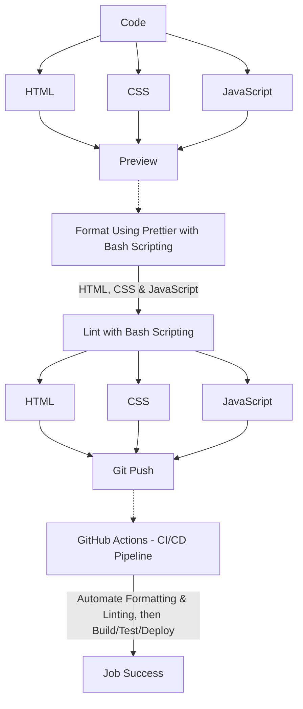

# Stages Of Deployment

This diagram outlines the development workflow for updating and deploying code, from coding to successful deployment.

Steps:
1. Code: Modify code in HTML, CSS, and JavaScript.

2. Preview: Review changes to ensure correctness.

3. Format & Lint: Use Bash for formatting and linting.

4. Push to Git: Commit changes to the Git repository.

5. CI/CD Pipeline: GitHub Actions triggers:

    - Rechecks formatting

    - Identifies any general errors

    - Runs build, test, and deployment processes.

