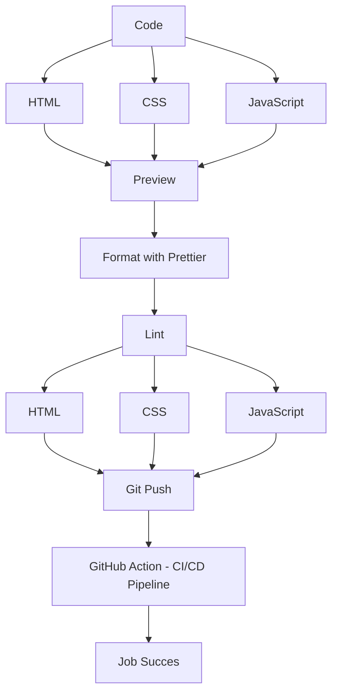

# Mermaid Diagram

```mermaid
flowchart TB
    %% Code update flow
    A[Code] --> B[HTML]
    A[Code] --> C[CSS]
    A[Code] --> D[JavaScript]
    B --> E[Preview]
    C --> E[Preview]
    D --> E[Preview]
    E --> F[Format with Prettier]
    F --> G[Lint]
    G --> H[HTML]
    G --> I[CSS]
    G --> J[JavaScript]
    H --> K[Git Push]  
    I --> K[Git Push]
    J --> K[Git Push]
    K --> L[GitHub Action - CI/CD Pipeline]
    L --> M[Job Succes]

```